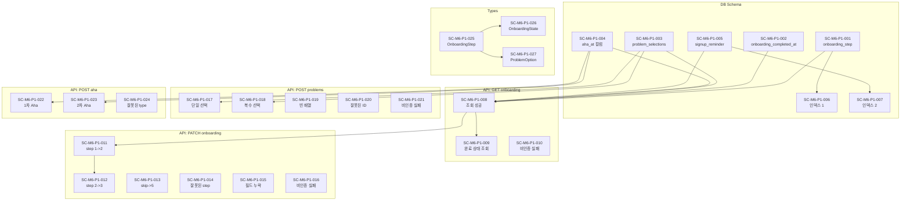

# Scenario: M6 Phase 1 - DB 스키마 & 기반 인프라

**Work Package:** WP-M6-Onboarding
**Phase:** 1
**총 Scenario 수:** 24개
**작성일:** 2026-02-04

---

## 1. DB 스키마 (1.1)

### SC-M6-P1-001: users 테이블에 onboarding_step 컬럼 추가 성공

- **Given:** 기존 users 테이블 존재
- **When:** Migration SQL 실행
- **Then:** onboarding_step INTEGER DEFAULT 1 컬럼 추가됨
- **선행 Scenario:** 없음

### SC-M6-P1-002: users 테이블에 onboarding_completed_at 컬럼 추가 성공

- **Given:** 기존 users 테이블 존재
- **When:** Migration SQL 실행
- **Then:** onboarding_completed_at TIMESTAMPTZ 컬럼 추가됨
- **선행 Scenario:** 없음

### SC-M6-P1-003: users 테이블에 problem_selections 컬럼 추가 성공

- **Given:** 기존 users 테이블 존재
- **When:** Migration SQL 실행
- **Then:** problem_selections JSONB DEFAULT '[]' 컬럼 추가됨
- **선행 Scenario:** 없음

### SC-M6-P1-004: users 테이블에 Aha Moment 타임스탬프 컬럼 추가 성공

- **Given:** 기존 users 테이블 존재
- **When:** Migration SQL 실행
- **Then:** first_aha_at, second_aha_at TIMESTAMPTZ 컬럼 추가됨
- **선행 Scenario:** 없음

### SC-M6-P1-005: users 테이블에 signup_reminder 컬럼 추가 성공

- **Given:** 기존 users 테이블 존재
- **When:** Migration SQL 실행
- **Then:** signup_reminder_sent_at TIMESTAMPTZ, signup_reminder_count INTEGER DEFAULT 0 컬럼 추가됨
- **선행 Scenario:** 없음

### SC-M6-P1-006: 온보딩 진행 상태 인덱스 생성 성공

- **Given:** onboarding_step, is_new_member 컬럼 존재
- **When:** CREATE INDEX 실행
- **Then:** idx_users_onboarding 인덱스 생성됨
- **선행 Scenario:** SC-M6-P1-001

### SC-M6-P1-007: 가입 후 리마인드 대상 조회 인덱스 생성 성공

- **Given:** created_at, signup_reminder_count 컬럼 존재
- **When:** CREATE INDEX 실행
- **Then:** idx_users_signup_reminder 부분 인덱스 생성됨 (is_new_member = true 조건)
- **선행 Scenario:** SC-M6-P1-005

---

## 2. 온보딩 상태 조회 API (1.2)

### SC-M6-P1-008: 인증된 사용자의 온보딩 상태 조회 성공

- **Given:** 인증된 사용자 존재 (onboarding_step = 1)
- **When:** GET /api/users/onboarding 요청
- **Then:** 200 OK, { step: 1, completedAt: null, problemSelections: [], firstAhaAt: null, secondAhaAt: null }
- **선행 Scenario:** SC-M6-P1-001 ~ SC-M6-P1-005

### SC-M6-P1-009: 온보딩 완료 사용자의 상태 조회 성공

- **Given:** 인증된 사용자 (onboarding_step = 5, onboarding_completed_at 설정됨)
- **When:** GET /api/users/onboarding 요청
- **Then:** 200 OK, { step: 5, completedAt: "2026-02-04T...", ... }
- **선행 Scenario:** SC-M6-P1-008

### SC-M6-P1-010: 비인증 사용자의 온보딩 상태 조회 실패

- **Given:** 인증되지 않은 상태
- **When:** GET /api/users/onboarding 요청
- **Then:** 401 Unauthorized, { error: { code: 1001, message: "인증이 필요합니다" } }
- **선행 Scenario:** 없음

---

## 3. 온보딩 상태 업데이트 API (1.3)

### SC-M6-P1-011: 온보딩 step 순차 업데이트 성공 (1 -> 2)

- **Given:** 인증된 사용자 (onboarding_step = 1)
- **When:** PATCH /api/users/onboarding { step: 2 }
- **Then:** 200 OK, { success: true, step: 2 }
- **선행 Scenario:** SC-M6-P1-008

### SC-M6-P1-012: 온보딩 step 순차 업데이트 성공 (2 -> 3)

- **Given:** 인증된 사용자 (onboarding_step = 2)
- **When:** PATCH /api/users/onboarding { step: 3 }
- **Then:** 200 OK, { success: true, step: 3 }
- **선행 Scenario:** SC-M6-P1-011

### SC-M6-P1-013: 온보딩 step 건너뛰기 (skip -> 5)

- **Given:** 인증된 사용자 (onboarding_step = 1)
- **When:** PATCH /api/users/onboarding { step: 5 }
- **Then:** 200 OK, { success: true, step: 5 }, onboarding_completed_at 설정됨
- **선행 Scenario:** SC-M6-P1-008

### SC-M6-P1-014: 유효하지 않은 step 값으로 업데이트 실패

- **Given:** 인증된 사용자
- **When:** PATCH /api/users/onboarding { step: 6 }
- **Then:** 400 Bad Request, { error: { code: 4001, message: "유효하지 않은 온보딩 단계입니다" } }
- **선행 Scenario:** SC-M6-P1-008

### SC-M6-P1-015: step 필드 누락 시 업데이트 실패

- **Given:** 인증된 사용자
- **When:** PATCH /api/users/onboarding { }
- **Then:** 400 Bad Request, { error: { code: 4002, message: "step 필드가 필요합니다" } }
- **선행 Scenario:** SC-M6-P1-008

### SC-M6-P1-016: 비인증 사용자의 온보딩 상태 업데이트 실패

- **Given:** 인증되지 않은 상태
- **When:** PATCH /api/users/onboarding { step: 2 }
- **Then:** 401 Unauthorized
- **선행 Scenario:** 없음

---

## 4. 문제 선택 저장 API (1.4)

### SC-M6-P1-017: 유효한 문제 선택 저장 성공 (단일)

- **Given:** 인증된 사용자
- **When:** POST /api/users/onboarding/problems { selections: ["unread_books"] }
- **Then:** 200 OK, { success: true }, problem_selections 컬럼에 ["unread_books"] 저장
- **선행 Scenario:** SC-M6-P1-003

### SC-M6-P1-018: 유효한 문제 선택 저장 성공 (복수)

- **Given:** 인증된 사용자
- **When:** POST /api/users/onboarding/problems { selections: ["unread_books", "routine_life", "want_belonging"] }
- **Then:** 200 OK, { success: true }, problem_selections 컬럼에 3개 항목 저장
- **선행 Scenario:** SC-M6-P1-003

### SC-M6-P1-019: 빈 배열로 문제 선택 저장 실패

- **Given:** 인증된 사용자
- **When:** POST /api/users/onboarding/problems { selections: [] }
- **Then:** 400 Bad Request, { error: { code: 4003, message: "최소 1개 이상 선택해주세요" } }
- **선행 Scenario:** SC-M6-P1-003

### SC-M6-P1-020: 유효하지 않은 문제 ID로 저장 실패

- **Given:** 인증된 사용자
- **When:** POST /api/users/onboarding/problems { selections: ["invalid_problem_id"] }
- **Then:** 400 Bad Request, { error: { code: 4004, message: "유효하지 않은 문제 선택입니다" } }
- **선행 Scenario:** SC-M6-P1-003

### SC-M6-P1-021: 비인증 사용자의 문제 선택 저장 실패

- **Given:** 인증되지 않은 상태
- **When:** POST /api/users/onboarding/problems { selections: ["unread_books"] }
- **Then:** 401 Unauthorized
- **선행 Scenario:** 없음

---

## 5. Aha Moment 기록 API (1.5)

### SC-M6-P1-022: 1차 Aha Moment 기록 성공

- **Given:** 인증된 사용자 (first_aha_at = null)
- **When:** POST /api/users/aha { type: "first" }
- **Then:** 200 OK, { success: true, timestamp: "2026-02-04T..." }, first_aha_at 설정됨
- **선행 Scenario:** SC-M6-P1-004

### SC-M6-P1-023: 2차 Aha Moment 기록 성공

- **Given:** 인증된 사용자 (second_aha_at = null)
- **When:** POST /api/users/aha { type: "second" }
- **Then:** 200 OK, { success: true, timestamp: "2026-02-04T..." }, second_aha_at 설정됨
- **선행 Scenario:** SC-M6-P1-004

### SC-M6-P1-024: 유효하지 않은 Aha type으로 기록 실패

- **Given:** 인증된 사용자
- **When:** POST /api/users/aha { type: "third" }
- **Then:** 400 Bad Request, { error: { code: 4005, message: "유효하지 않은 Aha Moment 타입입니다" } }
- **선행 Scenario:** SC-M6-P1-004

---

## 6. 온보딩 타입 정의 (1.6)

### SC-M6-P1-025: OnboardingStep 타입 정의

- **Given:** /types/onboarding.ts 파일 생성 필요
- **When:** 타입 파일 작성
- **Then:** OnboardingStep = 1 | 2 | 3 | 4 | 5 타입 정의됨
- **선행 Scenario:** 없음

### SC-M6-P1-026: OnboardingState 인터페이스 정의

- **Given:** /types/onboarding.ts 파일 생성 필요
- **When:** 타입 파일 작성
- **Then:** OnboardingState 인터페이스 정의됨 (step, completedAt, problemSelections, firstAhaAt, secondAhaAt)
- **선행 Scenario:** SC-M6-P1-025

### SC-M6-P1-027: ProblemOption 인터페이스 및 상수 정의

- **Given:** /types/onboarding.ts 파일 생성 필요
- **When:** 타입 파일 작성
- **Then:** ProblemOption 인터페이스 및 PROBLEM_OPTIONS 상수 정의됨
- **선행 Scenario:** SC-M6-P1-025

---

## 요약

| 분류 | 개수 | 비고 |
|------|:----:|------|
| DB 스키마 | 7개 | 1.1 |
| 온보딩 상태 조회 API | 3개 | 1.2 |
| 온보딩 상태 업데이트 API | 6개 | 1.3 |
| 문제 선택 저장 API | 5개 | 1.4 |
| Aha Moment 기록 API | 3개 | 1.5 |
| 타입 정의 | 3개 | 1.6 |
| **총계** | **27개** | |

### 우선순위별 분류

| 분류 | 개수 | Scenario |
|------|:----:|----------|
| Critical | 10개 | SC-M6-P1-001~007, SC-M6-P1-008, SC-M6-P1-011, SC-M6-P1-017 |
| High | 11개 | SC-M6-P1-009~010, SC-M6-P1-012~013, SC-M6-P1-018, SC-M6-P1-022~023, SC-M6-P1-025~027 |
| Medium | 6개 | SC-M6-P1-014~016, SC-M6-P1-019~021, SC-M6-P1-024 |

---

## 의존성 그래프

---

## 완료 기준 체크리스트

### DB 스키마
- [ ] onboarding_step INTEGER DEFAULT 1 추가
- [ ] onboarding_completed_at TIMESTAMPTZ 추가
- [ ] problem_selections JSONB DEFAULT '[]' 추가
- [ ] first_aha_at TIMESTAMPTZ 추가
- [ ] second_aha_at TIMESTAMPTZ 추가
- [ ] signup_reminder_sent_at TIMESTAMPTZ 추가
- [ ] signup_reminder_count INTEGER DEFAULT 0 추가
- [ ] idx_users_onboarding 인덱스 생성
- [ ] idx_users_signup_reminder 부분 인덱스 생성

### API 엔드포인트
- [ ] GET /api/users/onboarding - 200 응답
- [ ] PATCH /api/users/onboarding - 200 응답
- [ ] POST /api/users/onboarding/problems - 200 응답
- [ ] POST /api/users/aha - 200 응답

### 타입 정의
- [ ] OnboardingStep 타입 정의
- [ ] OnboardingState 인터페이스 정의
- [ ] ProblemOption 인터페이스 정의
- [ ] PROBLEM_OPTIONS 상수 정의

---

## 변경 이력

| 날짜 | 버전 | 변경 내용 |
|------|------|----------|
| 2026-02-04 | 1.0 | SC-M6-Onboarding-P1 최초 작성 |
| 2026-02-04 | 1.1 | 번호 체계 통일: SC-M6-xxx → SC-M6-P1-xxx |
