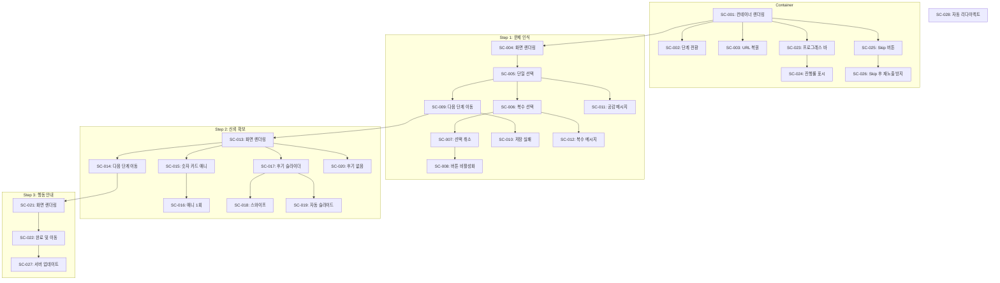

# Scenario: M6-Onboarding Phase 2 - 온보딩 1~3단계 UI

**Work Package:** WP-M6-Onboarding
**Phase:** 2
**총 Scenario 수:** 28개
**작성일:** 2026-02-04

---

## 개요

신규 회원 가입 시 온보딩 플로우 UI 구현을 위한 Scenario입니다.
온보딩 컨테이너, 문제 인식(1단계), 신뢰 확보(2단계), 행동 안내(3단계) 화면과
관련 컴포넌트들을 포함합니다.

---

## 2.1 온보딩 컨테이너 컴포넌트 (OnboardingContainer.tsx)

### SC-M6-P2-001: 온보딩 컨테이너 렌더링 성공

- **Given:** 신규 회원이 온보딩 페이지 접속
- **When:** OnboardingContainer 컴포넌트 마운트
- **Then:** 현재 step에 해당하는 화면 렌더링, 프로그레스 바 표시
- **선행 Scenario:** 없음

### SC-M6-P2-002: 단계별 화면 전환 성공

- **Given:** OnboardingContainer에서 step 1 표시 중
- **When:** "다음으로" 버튼 클릭
- **Then:** step 2 화면으로 전환, URL 쿼리 파라미터 업데이트 (`?step=2`)
- **선행 Scenario:** SC-M6-P2-001

### SC-M6-P2-003: URL 쿼리 파라미터로 단계 복원 성공

- **Given:** 사용자가 `onboarding?step=2` URL로 직접 접속
- **When:** OnboardingContainer 마운트
- **Then:** step 2 화면 바로 표시
- **선행 Scenario:** SC-M6-P2-001

---

## 2.2 1단계: 문제 인식 화면 (ProblemRecognition.tsx)

### SC-M6-P2-004: 문제 인식 화면 렌더링 성공

- **Given:** 온보딩 step 1 상태
- **When:** ProblemRecognition 컴포넌트 마운트
- **Then:** 4개의 문제 선택지 카드 표시, "다음으로" 버튼 비활성화 상태
- **선행 Scenario:** SC-M6-P2-001

### SC-M6-P2-005: 문제 선택지 단일 선택 성공

- **Given:** 문제 인식 화면에서 선택된 항목 없음
- **When:** "책 사놓고 안 읽은 지 꽤 됐다" 카드 탭
- **Then:** 해당 카드 선택 상태로 변경 (시각적 피드백), "다음으로" 버튼 활성화
- **선행 Scenario:** SC-M6-P2-004

### SC-M6-P2-006: 문제 선택지 복수 선택 성공

- **Given:** 1개 문제 선택된 상태
- **When:** 다른 문제 카드 탭
- **Then:** 2개 문제 모두 선택 상태, "다음으로" 버튼 활성화 유지
- **선행 Scenario:** SC-M6-P2-005

### SC-M6-P2-007: 문제 선택 취소 성공

- **Given:** 2개 문제 선택된 상태
- **When:** 선택된 카드 다시 탭
- **Then:** 해당 카드 선택 해제, 1개만 선택된 상태, "다음으로" 버튼 활성화 유지
- **선행 Scenario:** SC-M6-P2-006

### SC-M6-P2-008: 모든 선택 취소 시 버튼 비활성화

- **Given:** 1개 문제만 선택된 상태
- **When:** 선택된 카드 탭하여 선택 해제
- **Then:** 선택된 항목 없음, "다음으로" 버튼 비활성화
- **선행 Scenario:** SC-M6-P2-007

### SC-M6-P2-009: 문제 선택 후 다음 단계 이동 성공

- **Given:** 1개 이상 문제 선택된 상태
- **When:** "다음으로" 버튼 클릭
- **Then:** 선택 내용 서버에 저장 (POST /api/users/onboarding/problems), step 2로 이동
- **선행 Scenario:** SC-M6-P2-005

### SC-M6-P2-010: 문제 선택 저장 실패 시 에러 표시

- **Given:** 1개 이상 문제 선택된 상태
- **When:** "다음으로" 클릭했으나 API 호출 실패
- **Then:** 토스트 에러 메시지 표시, 현재 화면 유지, 재시도 가능
- **선행 Scenario:** SC-M6-P2-009

---

## 2.3 공감 메시지 컴포넌트 (EmpathyMessage.tsx)

### SC-M6-P2-011: 공감 메시지 표시 성공

- **Given:** 문제 선택 완료 상태
- **When:** 선택된 문제에 맞는 공감 메시지 조회
- **Then:** 해당 메시지 fade-in 애니메이션과 함께 표시
- **선행 Scenario:** SC-M6-P2-005

### SC-M6-P2-012: 복수 선택 시 첫 번째 메시지 표시

- **Given:** 2개 이상 문제 선택된 상태
- **When:** 공감 메시지 컴포넌트 렌더링
- **Then:** 첫 번째로 선택한 문제에 해당하는 메시지 표시
- **선행 Scenario:** SC-M6-P2-006

---

## 2.4 2단계: 신뢰 확보 화면 (TrustBuilding.tsx)

### SC-M6-P2-013: 신뢰 확보 화면 렌더링 성공

- **Given:** 온보딩 step 2 상태
- **When:** TrustBuilding 컴포넌트 마운트
- **Then:** 창업자 스토리 텍스트, 숫자 카드 영역, 후기 슬라이더 영역 표시
- **선행 Scenario:** SC-M6-P2-009

### SC-M6-P2-014: 신뢰 확보 화면에서 다음 단계 이동 성공

- **Given:** 신뢰 확보 화면 표시 중
- **When:** "다음으로" 버튼 클릭
- **Then:** step 3으로 이동, onboarding_step 서버 업데이트 (PATCH /api/users/onboarding)
- **선행 Scenario:** SC-M6-P2-013

---

## 2.5 숫자 카드 애니메이션 (NumberCards.tsx)

### SC-M6-P2-015: 숫자 카드 Stagger 애니메이션 재생 성공

- **Given:** TrustBuilding 화면 진입
- **When:** NumberCards 컴포넌트가 뷰포트에 진입
- **Then:** 3개 카드 (4명, 3년, 250명) 순차적으로 fade-in + slide-up (0.3초 간격)
- **선행 Scenario:** SC-M6-P2-013

### SC-M6-P2-016: 숫자 카드 애니메이션 한 번만 재생

- **Given:** 숫자 카드 애니메이션 완료된 상태
- **When:** 스크롤하여 뷰포트 이탈 후 재진입
- **Then:** 애니메이션 재생 없이 완료 상태 유지
- **선행 Scenario:** SC-M6-P2-015

---

## 2.6 회원 후기 슬라이더 (ReviewSlider.tsx)

### SC-M6-P2-017: 후기 슬라이더 렌더링 성공

- **Given:** TrustBuilding 화면 표시 중
- **When:** ReviewSlider 컴포넌트 마운트
- **Then:** 공개 동의 후기 (is_public=true) 최대 3개 표시, 인디케이터 표시
- **선행 Scenario:** SC-M6-P2-013

### SC-M6-P2-018: 후기 슬라이드 스와이프 성공

- **Given:** 후기 슬라이더에서 첫 번째 후기 표시 중
- **When:** 좌측으로 스와이프
- **Then:** 두 번째 후기로 전환, 인디케이터 업데이트
- **선행 Scenario:** SC-M6-P2-017

### SC-M6-P2-019: 후기 자동 슬라이드 동작

- **Given:** 후기 슬라이더 표시 중, 사용자 인터랙션 없음
- **When:** 5초 경과
- **Then:** 다음 후기로 자동 전환
- **선행 Scenario:** SC-M6-P2-017

### SC-M6-P2-020: 공개 후기 없을 시 슬라이더 숨김

- **Given:** 공개 동의 후기 0개인 상태
- **When:** ReviewSlider 컴포넌트 마운트
- **Then:** 슬라이더 영역 렌더링하지 않음 (조건부 렌더링)
- **선행 Scenario:** SC-M6-P2-013

---

## 2.7 3단계: 행동 안내 화면 (ActionGuide.tsx)

### SC-M6-P2-021: 행동 안내 화면 렌더링 성공

- **Given:** 온보딩 step 3 상태
- **When:** ActionGuide 컴포넌트 마운트
- **Then:** 3단계 플로우 (모임 고르기 -> 신청하기 -> 참여하기) 표시, 환불 안내 카드 표시
- **선행 Scenario:** SC-M6-P2-014

### SC-M6-P2-022: 모임 둘러보기 버튼 클릭 시 온보딩 완료 및 이동

- **Given:** 행동 안내 화면 표시 중
- **When:** "모임 둘러보기" 버튼 클릭
- **Then:** 온보딩 완료 처리 (onboarding_completed_at 설정), 홈페이지 또는 모임 목록으로 이동
- **선행 Scenario:** SC-M6-P2-021

---

## 2.8 프로그레스 바 컴포넌트 (OnboardingProgress.tsx)

### SC-M6-P2-023: 프로그레스 바 렌더링 성공

- **Given:** 온보딩 진행 중 (step 1~3)
- **When:** OnboardingProgress 컴포넌트 마운트
- **Then:** 현재 단계 표시, 진행률 퍼센티지 표시
- **선행 Scenario:** SC-M6-P2-001

### SC-M6-P2-024: 프로그레스 바 단계별 진행률 표시

- **Given:** 온보딩 step 2 상태
- **When:** OnboardingProgress 렌더링
- **Then:** 진행률 66% (2/3 단계) 표시, 시각적 게이지 업데이트
- **선행 Scenario:** SC-M6-P2-023

---

## 2.9 Skip 버튼

### SC-M6-P2-025: Skip 버튼 클릭 시 온보딩 건너뛰기 성공

- **Given:** 온보딩 화면 표시 중 (어느 단계든)
- **When:** "건너뛰기" 버튼 클릭
- **Then:** 온보딩 완료 처리 (onboarding_completed_at 즉시 설정), 홈페이지로 이동
- **선행 Scenario:** SC-M6-P2-001

### SC-M6-P2-026: Skip 후 온보딩 재노출 방지

- **Given:** Skip으로 온보딩 완료 처리된 사용자
- **When:** 앱 재접속 또는 새로고침
- **Then:** 온보딩 페이지로 리다이렉트되지 않음
- **선행 Scenario:** SC-M6-P2-025

---

## 2.10 온보딩 완료 처리

### SC-M6-P2-027: 온보딩 정상 완료 시 서버 상태 업데이트

- **Given:** 행동 안내 화면에서 "모임 둘러보기" 클릭
- **When:** 완료 API 호출 (PATCH /api/users/onboarding)
- **Then:** onboarding_step=4, onboarding_completed_at 타임스탬프 저장
- **선행 Scenario:** SC-M6-P2-022

---

## 2.11 신규 회원 라우팅 훅 (useOnboardingRedirect.ts)

### SC-M6-P2-028: 신규 회원 온보딩 페이지 자동 리다이렉트

- **Given:** is_new_member=true, onboarding_step < 4인 사용자 로그인
- **When:** 앱 메인 페이지 접속
- **Then:** /onboarding?step={현재단계}로 자동 리다이렉트
- **선행 Scenario:** 없음

---

## 요약

| 분류 | 개수 | 비고 |
|------|:----:|------|
| Critical | 8개 | 필수 (핵심 플로우) |
| High | 12개 | 권장 (주요 기능, 에러 처리) |
| Medium | 8개 | 선택 (편의 기능, 엣지 케이스) |
| **총계** | **28개** | |

### 분류 상세

**Critical (필수):**
- SC-M6-P2-001: 온보딩 컨테이너 렌더링 성공
- SC-M6-P2-004: 문제 인식 화면 렌더링 성공
- SC-M6-P2-005: 문제 선택지 단일 선택 성공
- SC-M6-P2-009: 문제 선택 후 다음 단계 이동 성공
- SC-M6-P2-013: 신뢰 확보 화면 렌더링 성공
- SC-M6-P2-021: 행동 안내 화면 렌더링 성공
- SC-M6-P2-022: 모임 둘러보기 버튼 클릭 시 온보딩 완료 및 이동
- SC-M6-P2-028: 신규 회원 온보딩 페이지 자동 리다이렉트

**High (권장):**
- SC-M6-P2-002: 단계별 화면 전환 성공
- SC-M6-P2-006: 문제 선택지 복수 선택 성공
- SC-M6-P2-010: 문제 선택 저장 실패 시 에러 표시
- SC-M6-P2-011: 공감 메시지 표시 성공
- SC-M6-P2-014: 신뢰 확보 화면에서 다음 단계 이동 성공
- SC-M6-P2-015: 숫자 카드 Stagger 애니메이션 재생 성공
- SC-M6-P2-017: 후기 슬라이더 렌더링 성공
- SC-M6-P2-023: 프로그레스 바 렌더링 성공
- SC-M6-P2-025: Skip 버튼 클릭 시 온보딩 건너뛰기 성공
- SC-M6-P2-026: Skip 후 온보딩 재노출 방지
- SC-M6-P2-027: 온보딩 정상 완료 시 서버 상태 업데이트
- SC-M6-P2-024: 프로그레스 바 단계별 진행률 표시

**Medium (선택):**
- SC-M6-P2-003: URL 쿼리 파라미터로 단계 복원 성공
- SC-M6-P2-007: 문제 선택 취소 성공
- SC-M6-P2-008: 모든 선택 취소 시 버튼 비활성화
- SC-M6-P2-012: 복수 선택 시 첫 번째 메시지 표시
- SC-M6-P2-016: 숫자 카드 애니메이션 한 번만 재생
- SC-M6-P2-018: 후기 슬라이드 스와이프 성공
- SC-M6-P2-019: 후기 자동 슬라이드 동작
- SC-M6-P2-020: 공개 후기 없을 시 슬라이더 숨김

---

## 의존성 그래프

---

## 완료 기준

Phase 2 완료 시 다음 조건 충족:

1. **기능 완료:**
   - [ ] 신규 가입 시 1단계 문제 인식 화면 표시
   - [ ] 문제 1개 이상 선택 시 "다음으로" 버튼 활성화
   - [ ] 선택 후 공감 메시지 표시 (애니메이션)
   - [ ] 2단계 숫자 카드 Stagger 애니메이션 재생
   - [ ] 회원 후기 슬라이더 동작 (공개 동의 후기만)
   - [ ] 3단계 프로그레스 바 표시
   - [ ] "건너뛰기" 클릭 시 온보딩 완료 처리
   - [ ] 온보딩 완료 후 홈으로 리다이렉트

2. **품질 기준:**
   - [ ] 모바일 최적화 (360px 기준)
   - [ ] 애니메이션 60fps 유지
   - [ ] No-Emoji 정책 준수 (Lucide 아이콘 사용)
   - [ ] TypeScript strict 모드 통과
   - [ ] ESLint 경고 없음

---

## 변경 이력

| 날짜 | 버전 | 변경 내용 |
|------|------|----------|
| 2026-02-04 | 1.0 | SC-M6-Onboarding-P2 최초 작성 |
