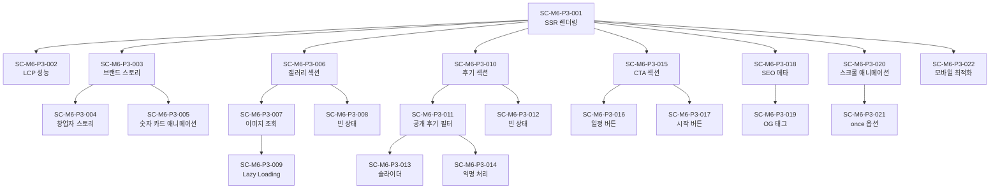

# Scenario: M6-Onboarding Phase 3 - 후킹 랜딩페이지 개선

**Work Package:** WP-M6-Onboarding
**Phase:** 3
**총 Scenario 수:** 22개
**작성일:** 2026-02-04

---

## 개요

Phase 3은 `/about` 페이지를 SEO 최적화된 브랜드 스토리 페이지로 개선하는 작업입니다.
검색 유입 사용자가 지독해의 브랜드와 분위기를 한눈에 파악하고 가입을 결심하도록 유도합니다.

**사용자 가치:**
> "검색 유입 사용자가 지독해의 브랜드와 분위기를 한눈에 파악하고 가입을 결심한다"

---

## 3.1 랜딩페이지 재설계 (SSR)

### SC-M6-P3-001: /about 페이지 SSR 렌더링 성공

- **Given:** Next.js App Router 환경
- **When:** /about 경로로 접근
- **Then:** Server Component로 렌더링되며 HTML에 초기 콘텐츠 포함
- **선행 Scenario:** 없음

### SC-M6-P3-002: /about 페이지 LCP 2.5초 이내

- **Given:** /about 페이지가 SSR로 구현됨
- **When:** Lighthouse로 성능 측정
- **Then:** LCP(Largest Contentful Paint)가 2.5초 이내
- **선행 Scenario:** SC-M6-P3-001

---

## 3.2 브랜드 스토리 섹션

### SC-M6-P3-003: 브랜드 스토리 섹션 렌더링 성공

- **Given:** /about 페이지 진입
- **When:** 페이지 로드 완료
- **Then:** BrandStory.tsx 컴포넌트가 "우리의 이야기" 섹션으로 표시됨
- **선행 Scenario:** SC-M6-P3-001

### SC-M6-P3-004: 창업자 스토리 콘텐츠 표시

- **Given:** 브랜드 스토리 섹션 렌더링됨
- **When:** 섹션 내용 확인
- **Then:** "4명이 시작", "3년이 지나", "250명이 함께" 숫자 카드가 표시됨
- **선행 Scenario:** SC-M6-P3-003

### SC-M6-P3-005: 숫자 카드 Stagger 애니메이션 재생

- **Given:** 브랜드 스토리 섹션이 뷰포트에 진입
- **When:** Intersection Observer 트리거
- **Then:** 숫자 카드가 0.3초 간격으로 순차적으로 fade-in
- **선행 Scenario:** SC-M6-P3-003

---

## 3.3 분위기 갤러리

### SC-M6-P3-006: 분위기 갤러리 섹션 렌더링 성공

- **Given:** /about 페이지 진입
- **When:** 페이지 로드 완료
- **Then:** AtmosphereGallery.tsx 컴포넌트가 "이런 분위기예요" 섹션으로 표시됨
- **선행 Scenario:** SC-M6-P3-001

### SC-M6-P3-007: gallery_images 테이블에서 이미지 조회 성공

- **Given:** gallery_images 테이블에 is_active=true인 이미지 존재
- **When:** 갤러리 섹션 데이터 페칭
- **Then:** display_order 순서대로 이미지 목록 반환
- **선행 Scenario:** SC-M6-P3-006

### SC-M6-P3-008: 갤러리 이미지 없을 때 빈 상태 표시

- **Given:** gallery_images 테이블에 활성 이미지 없음
- **When:** 갤러리 섹션 렌더링
- **Then:** "아직 분위기 사진이 없어요" 빈 상태 메시지 표시
- **선행 Scenario:** SC-M6-P3-006

### SC-M6-P3-009: 갤러리 이미지 Lazy Loading 적용

- **Given:** 갤러리 이미지가 뷰포트 밖에 있음
- **When:** 스크롤하여 뷰포트 진입
- **Then:** 이미지가 lazy loading으로 로드됨 (loading="lazy" 또는 Intersection Observer)
- **선행 Scenario:** SC-M6-P3-007

---

## 3.4 회원 후기 섹션

### SC-M6-P3-010: 회원 후기 섹션 렌더링 성공

- **Given:** /about 페이지 진입
- **When:** 페이지 로드 완료
- **Then:** PublicReviews.tsx 컴포넌트가 "회원분들의 이야기" 섹션으로 표시됨
- **선행 Scenario:** SC-M6-P3-001

### SC-M6-P3-011: 공개 동의 후기만 조회 성공

- **Given:** reviews 테이블에 is_public=true, is_public=false 후기 모두 존재
- **When:** 후기 섹션 데이터 페칭
- **Then:** is_public=true인 후기만 반환됨
- **선행 Scenario:** SC-M6-P3-010

### SC-M6-P3-012: 후기 없을 때 빈 상태 표시

- **Given:** reviews 테이블에 is_public=true인 후기 없음
- **When:** 후기 섹션 렌더링
- **Then:** "아직 공개된 후기가 없어요" 빈 상태 메시지 표시
- **선행 Scenario:** SC-M6-P3-010

### SC-M6-P3-013: 후기 슬라이더 동작

- **Given:** 공개 후기 3개 이상 존재
- **When:** 후기 섹션 렌더링
- **Then:** 슬라이더/캐러셀 형태로 후기 표시, 좌우 스와이프 가능
- **선행 Scenario:** SC-M6-P3-011

### SC-M6-P3-014: 후기 작성자 익명 처리

- **Given:** 후기 데이터에 작성자 정보 포함
- **When:** 후기 카드 렌더링
- **Then:** 작성자명은 "익명" 또는 "O*님" 형식으로 마스킹 처리
- **선행 Scenario:** SC-M6-P3-011

---

## 3.5 CTA 섹션

### SC-M6-P3-015: CTA 섹션 렌더링 성공

- **Given:** /about 페이지 진입
- **When:** 페이지 하단 도달
- **Then:** LandingCTA.tsx 컴포넌트가 "함께해요" 섹션으로 표시됨
- **선행 Scenario:** SC-M6-P3-001

### SC-M6-P3-016: "일정 보러가기" 버튼 클릭 시 홈으로 이동

- **Given:** CTA 섹션 표시됨
- **When:** "일정 보러가기" 버튼 클릭
- **Then:** "/" (홈 페이지)로 이동
- **선행 Scenario:** SC-M6-P3-015

### SC-M6-P3-017: "지금 시작하기" 버튼 클릭 시 회원가입으로 이동

- **Given:** CTA 섹션 표시됨, 비로그인 상태
- **When:** "지금 시작하기" 버튼 클릭
- **Then:** "/login" 또는 "/signup" 페이지로 이동
- **선행 Scenario:** SC-M6-P3-015

---

## 3.6 SEO 메타데이터

### SC-M6-P3-018: SEO 메타데이터 설정 성공

- **Given:** /about 페이지 구현됨
- **When:** 페이지 소스 확인
- **Then:** title, description, keywords 메타 태그가 올바르게 설정됨
- **선행 Scenario:** SC-M6-P3-001

### SC-M6-P3-019: Open Graph 태그 설정 성공

- **Given:** /about 페이지 구현됨
- **When:** 페이지 소스 확인
- **Then:** og:title, og:description, og:image 태그가 설정됨
- **선행 Scenario:** SC-M6-P3-001

---

## 3.7 스크롤 애니메이션

### SC-M6-P3-020: 섹션별 reveal 애니메이션 동작

- **Given:** /about 페이지 진입
- **When:** 각 섹션이 뷰포트에 진입
- **Then:** 섹션이 opacity 0 -> 1, y 50 -> 0 애니메이션으로 표시됨
- **선행 Scenario:** SC-M6-P3-001

### SC-M6-P3-021: 애니메이션 once 옵션 적용

- **Given:** 섹션 reveal 애니메이션 재생됨
- **When:** 스크롤 업/다운 반복
- **Then:** 애니메이션은 최초 1회만 재생 (once: true)
- **선행 Scenario:** SC-M6-P3-020

---

## 3.8 모바일 최적화

### SC-M6-P3-022: 360px 모바일 뷰포트에서 UI 정상 표시

- **Given:** 360px 너비 모바일 기기
- **When:** /about 페이지 접근
- **Then:** 모든 섹션이 가로 스크롤 없이 정상 표시, 터치 영역 44px 이상
- **선행 Scenario:** SC-M6-P3-001

---

## 요약

| 분류 | 개수 | 비고 |
|------|:----:|------|
| Critical | 8개 | SSR, 데이터 조회, SEO, CTA |
| High | 10개 | 애니메이션, 빈 상태, 슬라이더 |
| Medium | 4개 | 성능, Lazy Loading |
| **총계** | **22개** | |

### 분류별 상세

**Critical (필수):**
- SC-M6-P3-001: SSR 렌더링
- SC-M6-P3-003: 브랜드 스토리 섹션
- SC-M6-P3-006: 갤러리 섹션
- SC-M6-P3-010: 후기 섹션
- SC-M6-P3-011: 공개 후기 필터링
- SC-M6-P3-015: CTA 섹션
- SC-M6-P3-018: SEO 메타데이터
- SC-M6-P3-019: OG 태그

**High (권장):**
- SC-M6-P3-004: 창업자 스토리 콘텐츠
- SC-M6-P3-005: 숫자 카드 애니메이션
- SC-M6-P3-007: 갤러리 이미지 조회
- SC-M6-P3-008: 갤러리 빈 상태
- SC-M6-P3-012: 후기 빈 상태
- SC-M6-P3-013: 후기 슬라이더
- SC-M6-P3-014: 작성자 익명 처리
- SC-M6-P3-016: 일정 보러가기 버튼
- SC-M6-P3-017: 지금 시작하기 버튼
- SC-M6-P3-022: 모바일 최적화

**Medium (선택):**
- SC-M6-P3-002: LCP 성능
- SC-M6-P3-009: Lazy Loading
- SC-M6-P3-020: 스크롤 애니메이션
- SC-M6-P3-021: 애니메이션 once 옵션

---

## 의존성 그래프

---

## 구현 시 주의사항

### No-Emoji 정책
- 모든 아이콘은 Lucide React 사용
- 이모지 절대 사용 금지

### 테마 대응
- CSS 변수 기반 색상 사용 (`var(--primary)`, `var(--text)` 등)
- Electric/Warm 테마 모두에서 가독성 확보
- Electric 모드: 라임색(`#CCFF00`) 텍스트 사용 금지

### 성능
- Server Component로 SSR 구현 (데이터 페칭은 서버에서)
- 이미지는 next/image + lazy loading
- 애니메이션은 GPU 가속 활용 (transform, opacity)

### 접근성
- 모바일 터치 영역 최소 44px
- 이미지에 alt 태그 필수
- 키보드 네비게이션 지원

---

## 변경 이력

| 날짜 | 버전 | 변경 내용 |
|------|------|----------|
| 2026-02-04 | 1.0 | SC-M6-Onboarding-P3 최초 작성 |
