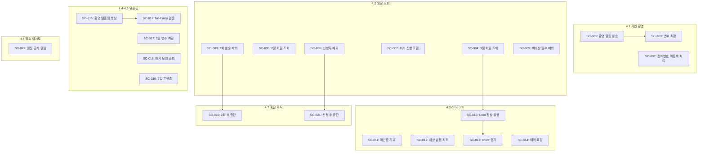

# Scenario: M6-Onboarding Phase 4 - 가입 후 리마인드 시퀀스

**Work Package:** WP-M6-Onboarding
**Phase:** 4
**총 Scenario 수:** 22개
**작성일:** 2026-02-04

---

## 개요

Phase 4는 **가입 후 3일/7일/14일 자동 리마인드 알림 시스템**을 구축합니다.
Balfour 원칙에 따라 "당신이 안 했다"가 아닌 "당신이 얻을 수 있는 것"을 전달합니다.

**핵심 규칙:**
- 14일 규칙: 2회 연속 무시 시 알림 중단
- No-Emoji Policy: 모든 알림에서 이모지 금지
- 이미 신청한 회원은 리마인드 대상에서 제외

---

## 4.1 가입 환영 알림 발송

### SC-M6-P4-001: 회원가입 즉시 환영 알림 발송 성공

- **Given:** 신규 회원이 회원가입을 완료하고 phone 번호가 등록됨
- **When:** 회원가입 트리거가 실행됨
- **Then:** 환영 알림이 즉시 발송되고, notification_logs에 기록됨
- **선행 Scenario:** 없음

### SC-M6-P4-002: 전화번호 미등록 회원에게 환영 알림 미발송

- **Given:** 신규 회원이 회원가입했으나 phone 번호가 null
- **When:** 회원가입 트리거가 실행됨
- **Then:** 알림이 발송되지 않고, 로그에 "no_phone_number" 경고 기록
- **선행 Scenario:** 없음

### SC-M6-P4-003: 환영 알림 템플릿 변수 치환 검증

- **Given:** 환영 알림 템플릿에 #{회원명}, #{책제목}, #{신청인원} 변수 포함
- **When:** 신규 회원 가입 시 알림 발송
- **Then:** 모든 변수가 실제 값으로 치환되어 발송됨
- **선행 Scenario:** SC-M6-P4-001

---

## 4.2 리마인드 대상 조회 로직

### SC-M6-P4-004: 가입 후 3일 된 미신청 회원 조회 성공

- **Given:** 3일 전 가입한 신규 회원(is_new_member=true)이 존재하고, 신청 이력 없음
- **When:** getSignupReminderTargets() 함수 호출
- **Then:** 해당 회원이 reminderType='day3'로 반환됨
- **선행 Scenario:** 없음

### SC-M6-P4-005: 가입 후 7일 된 미신청 회원 조회 성공

- **Given:** 7일 전 가입한 신규 회원(is_new_member=true)이 존재하고, 신청 이력 없음
- **When:** getSignupReminderTargets() 함수 호출
- **Then:** 해당 회원이 reminderType='day7'로 반환됨
- **선행 Scenario:** 없음

### SC-M6-P4-006: 이미 신청한 회원 제외 검증

- **Given:** 3일 전 가입한 신규 회원이 이미 모임에 신청(status != 'cancelled')
- **When:** getSignupReminderTargets() 함수 호출
- **Then:** 해당 회원이 대상에서 제외됨 (빈 배열 또는 미포함)
- **선행 Scenario:** 없음

### SC-M6-P4-007: 취소된 신청만 있는 회원 포함 검증

- **Given:** 3일 전 가입한 신규 회원의 모든 신청이 status='cancelled'
- **When:** getSignupReminderTargets() 함수 호출
- **Then:** 해당 회원이 리마인드 대상에 포함됨
- **선행 Scenario:** 없음

### SC-M6-P4-008: signup_reminder_count >= 2인 회원 제외

- **Given:** 신규 회원의 signup_reminder_count가 2 이상
- **When:** getSignupReminderTargets() 함수 호출
- **Then:** 해당 회원이 대상에서 제외됨 (14일 규칙)
- **선행 Scenario:** 없음

### SC-M6-P4-009: 가입 후 1일/2일/4일 회원 제외 검증

- **Given:** 가입한 지 1일, 2일, 4일 된 신규 회원들이 존재
- **When:** getSignupReminderTargets() 함수 호출
- **Then:** 모든 회원이 대상에서 제외됨 (정확히 3일 또는 7일만 해당)
- **선행 Scenario:** 없음

---

## 4.3 리마인드 Cron Job

### SC-M6-P4-010: Cron Job 정상 실행 및 알림 발송

- **Given:** 가입 후 3일 된 미신청 회원 2명 존재
- **When:** GET /api/cron/onboarding-signup 호출
- **Then:** 2건의 알림 발송, stats.sent=2 반환
- **선행 Scenario:** SC-M6-P4-004

### SC-M6-P4-011: Cron Job 미인증 요청 거부

- **Given:** CRON_SECRET이 설정되어 있음
- **When:** Authorization 헤더 없이 GET /api/cron/onboarding-signup 호출
- **Then:** 401 Unauthorized 반환
- **선행 Scenario:** 없음

### SC-M6-P4-012: Cron Job 대상자 없을 때 정상 완료

- **Given:** 리마인드 대상 회원이 없음
- **When:** GET /api/cron/onboarding-signup 호출
- **Then:** stats.total=0, stats.sent=0으로 정상 완료
- **선행 Scenario:** 없음

### SC-M6-P4-013: signup_reminder_count 증가 검증

- **Given:** 3일 전 가입 회원의 signup_reminder_count=0
- **When:** Cron Job 실행 후 알림 발송 성공
- **Then:** signup_reminder_count=1로 업데이트, signup_reminder_sent_at에 현재 시간 기록
- **선행 Scenario:** SC-M6-P4-010

### SC-M6-P4-014: 알림 발송 실패 시 에러 로깅

- **Given:** Solapi API 오류 발생 상황
- **When:** Cron Job이 알림 발송 시도
- **Then:** 에러가 로깅되고, signup_reminder_count는 증가하지 않음
- **선행 Scenario:** 없음

---

## 4.4 알림 템플릿: 가입 환영

### SC-M6-P4-015: 가입 환영 템플릿 생성 확인

- **Given:** notification_templates 테이블에 'signup_welcome' 템플릿 없음
- **When:** 템플릿 INSERT 실행
- **Then:** 템플릿이 정상 생성되고 is_active=true
- **선행 Scenario:** 없음

### SC-M6-P4-016: 가입 환영 메시지 No-Emoji 검증

- **Given:** 'signup_welcome' 템플릿이 존재
- **When:** 템플릿 message_template 조회
- **Then:** 이모지가 포함되지 않음
- **선행 Scenario:** SC-M6-P4-015

---

## 4.5 알림 템플릿: 3일 후

### SC-M6-P4-017: 3일 리마인드 템플릿 변수 치환 검증

- **Given:** 'signup_reminder_day3' 템플릿에 #{회원명}, #{요일}, #{지역}, #{남은자리} 변수 포함
- **When:** 템플릿 변수 치환 실행
- **Then:** 모든 변수가 동적 데이터로 치환됨
- **선행 Scenario:** 없음

### SC-M6-P4-018: 인기 모임 정보 동적 조회 검증

- **Given:** 다음 주에 예정된 모임 3개 존재, 각각 신청 5명/10명/3명
- **When:** getMostPopularMeeting() 함수 호출
- **Then:** 신청 10명인 모임 정보가 반환됨
- **선행 Scenario:** 없음

---

## 4.6 알림 템플릿: 7일 후

### SC-M6-P4-019: 7일 리마인드 템플릿 콘텐츠 맛보기 검증

- **Given:** 'signup_reminder_day7' 템플릿이 존재
- **When:** 7일 후 알림 발송
- **Then:** 지난 모임의 대화 요약 또는 후기 일부가 포함됨
- **선행 Scenario:** 없음

---

## 4.7 14일 알림 중단 로직

### SC-M6-P4-020: 2회 발송 후 추가 알림 중단 검증

- **Given:** 신규 회원의 signup_reminder_count=2
- **When:** Cron Job 실행
- **Then:** 해당 회원에게 알림이 발송되지 않음
- **선행 Scenario:** SC-M6-P4-008

### SC-M6-P4-021: 1회 발송 후 신청 시 추가 알림 중단

- **Given:** 신규 회원이 3일 후 알림 수신 후 모임 신청
- **When:** 7일 시점에 Cron Job 실행
- **Then:** 해당 회원은 이미 신청자이므로 알림 미발송
- **선행 Scenario:** SC-M6-P4-006

---

## 4.8 다음 달 일정 공개 재시도

### SC-M6-P4-022: 월초 일정 공개 알림 발송

- **Given:** 신규 회원이 signup_reminder_count < 2이고 미신청 상태
- **When:** 월초 일정 공개 Cron Job 실행 (매월 1일)
- **Then:** 다음 달 일정 안내 알림 발송 (signup_reminder_count와 별도 카운트)
- **선행 Scenario:** 없음

---

## 요약

| 분류 | 개수 | 비고 |
|------|:----:|------|
| Critical | 8개 | 필수 - 핵심 알림 발송 및 조회 로직 |
| High | 10개 | 권장 - 예외 처리 및 비즈니스 규칙 |
| Medium | 4개 | 선택 - 템플릿 검증 및 보조 기능 |
| **총계** | **22개** | |

### 분류 상세

**Critical (필수):**
- SC-M6-P4-001: 회원가입 즉시 환영 알림 발송 성공
- SC-M6-P4-004: 가입 후 3일 된 미신청 회원 조회 성공
- SC-M6-P4-005: 가입 후 7일 된 미신청 회원 조회 성공
- SC-M6-P4-006: 이미 신청한 회원 제외 검증
- SC-M6-P4-010: Cron Job 정상 실행 및 알림 발송
- SC-M6-P4-013: signup_reminder_count 증가 검증
- SC-M6-P4-020: 2회 발송 후 추가 알림 중단 검증
- SC-M6-P4-021: 1회 발송 후 신청 시 추가 알림 중단

**High (권장):**
- SC-M6-P4-002: 전화번호 미등록 회원에게 환영 알림 미발송
- SC-M6-P4-003: 환영 알림 템플릿 변수 치환 검증
- SC-M6-P4-007: 취소된 신청만 있는 회원 포함 검증
- SC-M6-P4-008: signup_reminder_count >= 2인 회원 제외
- SC-M6-P4-009: 가입 후 1일/2일/4일 회원 제외 검증
- SC-M6-P4-011: Cron Job 미인증 요청 거부
- SC-M6-P4-012: Cron Job 대상자 없을 때 정상 완료
- SC-M6-P4-014: 알림 발송 실패 시 에러 로깅
- SC-M6-P4-017: 3일 리마인드 템플릿 변수 치환 검증
- SC-M6-P4-018: 인기 모임 정보 동적 조회 검증

**Medium (선택):**
- SC-M6-P4-015: 가입 환영 템플릿 생성 확인
- SC-M6-P4-016: 가입 환영 메시지 No-Emoji 검증
- SC-M6-P4-019: 7일 리마인드 템플릿 콘텐츠 맛보기 검증
- SC-M6-P4-022: 월초 일정 공개 알림 발송

---

## 의존성 그래프

---

## 테스트 데이터 시나리오

### 테스트에 필요한 사용자 셋업

| 사용자 | 가입일 | is_new_member | signup_reminder_count | 신청 이력 |
|--------|--------|---------------|----------------------|-----------|
| User A | 3일 전 | true | 0 | 없음 |
| User B | 7일 전 | true | 1 | 없음 |
| User C | 3일 전 | true | 0 | confirmed |
| User D | 3일 전 | true | 2 | 없음 |
| User E | 2일 전 | true | 0 | 없음 |
| User F | 3일 전 | true | 0 | cancelled |

### 기대 결과

- **3일 Cron 실행 시:** User A, User F만 대상
- **7일 Cron 실행 시:** User B만 대상
- **제외 사유:**
  - User C: 이미 신청함
  - User D: 2회 발송 완료
  - User E: 3일 미도달

---

## 관련 파일 경로

| 구분 | 파일 경로 |
|------|----------|
| 대상 조회 로직 | `/lib/onboarding/reminder.ts` |
| Cron Job | `/api/cron/onboarding-signup/route.ts` |
| 알림 템플릿 | notification_templates 테이블 |
| 알림 발송 | `/lib/notification/send.ts` |
| 로거 | `/lib/logger.ts` |

---

## 변경 이력

| 날짜 | 버전 | 변경 내용 |
|------|------|----------|
| 2026-02-04 | 1.0 | SC-M6-Onboarding-P4 최초 작성 |
