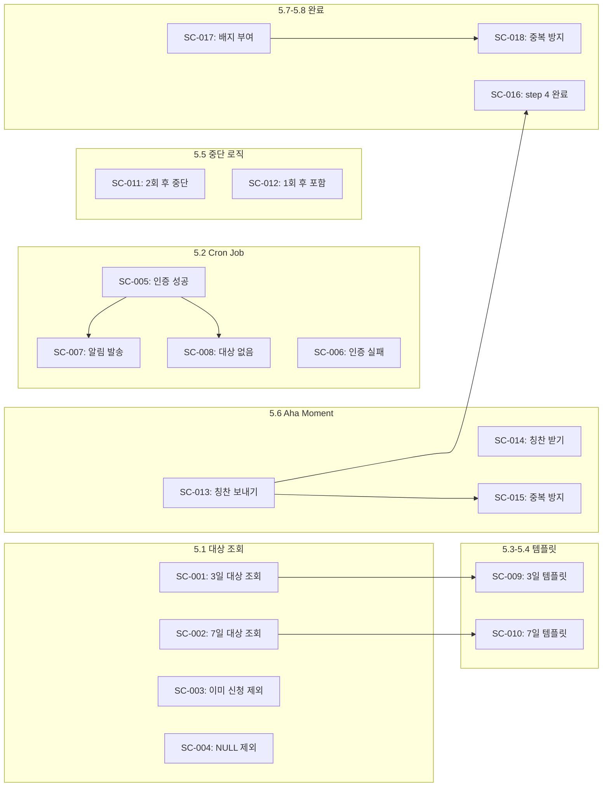

# Scenario: M6-Onboarding Phase 5 - 첫 모임 후 리마인드 & Aha Moment

**Work Package:** WP-M6-Onboarding
**Phase:** 5
**총 Scenario 수:** 18개
**작성일:** 2026-02-04

---

## 개요

Phase 5는 첫 모임 참여 후 재참여를 유도하고, Aha Moment(칭찬 보내기/받기)를 통해 소속감을 강화하는 단계입니다.

**목표:** 첫 참여 -> 두 번째 신청 전환율 50% 이상, 신규 회원 재참여율 70% 달성

---

## 5.1 첫 모임 후 리마인드 대상 조회

### SC-M6-P5-001: 첫 모임 후 3일 된 미신청 회원 조회 성공

- **Given:** 첫 정기모임 참여 후 정확히 3일이 지난 회원이 존재하고, 두 번째 모임을 신청하지 않음
- **When:** `getFirstMeetingReminderTargets()` 함수 호출
- **Then:** 해당 회원이 `reminderType: 'day3'`로 결과에 포함됨
- **선행 Scenario:** 없음

### SC-M6-P5-002: 첫 모임 후 7일 된 미신청 회원 조회 성공

- **Given:** 첫 정기모임 참여 후 정확히 7일이 지난 회원이 존재하고, 두 번째 모임을 신청하지 않음
- **When:** `getFirstMeetingReminderTargets()` 함수 호출
- **Then:** 해당 회원이 `reminderType: 'day7'`로 결과에 포함됨
- **선행 Scenario:** 없음

### SC-M6-P5-003: 이미 두 번째 신청한 회원 제외 성공

- **Given:** 첫 정기모임 참여 후 3일이 지났으나, 이미 두 번째 모임을 신청한 회원 존재
- **When:** `getFirstMeetingReminderTargets()` 함수 호출
- **Then:** 해당 회원이 결과에 포함되지 않음
- **선행 Scenario:** 없음

### SC-M6-P5-004: first_regular_meeting_at이 NULL인 회원 제외

- **Given:** `first_regular_meeting_at`이 NULL인 회원 존재 (아직 첫 모임 미참여)
- **When:** `getFirstMeetingReminderTargets()` 함수 호출
- **Then:** 해당 회원이 결과에 포함되지 않음
- **선행 Scenario:** 없음

---

## 5.2 첫 모임 후 Cron Job

### SC-M6-P5-005: Cron Job 인증 성공

- **Given:** 올바른 `CRON_SECRET`이 Authorization 헤더에 포함됨
- **When:** `GET /api/cron/onboarding-first-meeting` 호출
- **Then:** 200 OK 응답, 리마인드 대상 처리 시작
- **선행 Scenario:** 없음

### SC-M6-P5-006: Cron Job 인증 실패

- **Given:** 잘못된 Authorization 헤더 또는 헤더 없음
- **When:** `GET /api/cron/onboarding-first-meeting` 호출
- **Then:** 401 Unauthorized 응답
- **선행 Scenario:** 없음

### SC-M6-P5-007: 리마인드 알림 발송 및 카운트 업데이트

- **Given:** 첫 모임 후 3일 된 미신청 회원 1명 존재
- **When:** Cron Job 실행
- **Then:** 알림 발송 성공, `first_meeting_reminder_count` 1 증가, `first_meeting_reminder_sent_at` 업데이트
- **선행 Scenario:** SC-M6-P5-005

### SC-M6-P5-008: 대상 없을 때 정상 종료

- **Given:** 리마인드 대상이 0명
- **When:** Cron Job 실행
- **Then:** `{ sent: 0 }` 응답, 에러 없이 종료
- **선행 Scenario:** SC-M6-P5-005

---

## 5.3-5.4 알림 템플릿

### SC-M6-P5-009: 3일 후 알림 템플릿 변수 치환 성공

- **Given:** `first_meeting_day3` 템플릿이 등록되어 있고, 리마인드 대상 존재
- **When:** 알림 발송 시 템플릿 변수 치환
- **Then:** `#{회원명}`, `#{다음모임일시}`, `#{신청인원}` 변수가 실제 값으로 치환됨
- **선행 Scenario:** SC-M6-P5-001

### SC-M6-P5-010: 7일 후 알림 템플릿 변수 치환 성공

- **Given:** `first_meeting_day7` 템플릿이 등록되어 있고, 리마인드 대상 존재
- **When:** 알림 발송 시 템플릿 변수 치환
- **Then:** `#{회원명}`, `#{지역}`, `#{책제목}` 변수가 실제 값으로 치환됨
- **선행 Scenario:** SC-M6-P5-002

---

## 5.5 14일 알림 중단 로직

### SC-M6-P5-011: 2회 발송 후 알림 중단

- **Given:** `first_meeting_reminder_count`가 2 이상인 회원 존재
- **When:** `getFirstMeetingReminderTargets()` 함수 호출
- **Then:** 해당 회원이 결과에 포함되지 않음 (14일 규칙)
- **선행 Scenario:** 없음

### SC-M6-P5-012: 1회 발송 후 7일 알림 대상 포함

- **Given:** `first_meeting_reminder_count`가 1이고, 첫 모임 후 7일 된 회원 존재
- **When:** `getFirstMeetingReminderTargets()` 함수 호출
- **Then:** 해당 회원이 `reminderType: 'day7'`로 결과에 포함됨
- **선행 Scenario:** 없음

---

## 5.6 Aha Moment 기록 연동

### SC-M6-P5-013: 칭찬 보내기 시 first_aha_at 기록

- **Given:** `first_aha_at`이 NULL인 회원이 존재
- **When:** 해당 회원이 다른 회원에게 칭찬 보내기
- **Then:** `first_aha_at`에 현재 타임스탬프 기록, "첫 칭찬 보내기" 배지 부여
- **선행 Scenario:** 없음

### SC-M6-P5-014: 칭찬 받기 시 second_aha_at 기록

- **Given:** `second_aha_at`이 NULL인 회원이 존재
- **When:** 해당 회원이 다른 회원으로부터 칭찬 받기
- **Then:** `second_aha_at`에 현재 타임스탬프 기록, "첫 칭찬 받기" 배지 부여
- **선행 Scenario:** 없음

### SC-M6-P5-015: 이미 Aha Moment 기록된 경우 중복 방지

- **Given:** `first_aha_at`이 이미 기록된 회원이 존재
- **When:** 해당 회원이 또 다른 칭찬 보내기
- **Then:** `first_aha_at` 값 변경 없음, 배지 중복 부여 없음
- **선행 Scenario:** SC-M6-P5-013

---

## 5.7 칭찬 시스템 onboarding_step 연계

### SC-M6-P5-016: 칭찬 후 onboarding_step 4 완료 처리

- **Given:** `onboarding_step`이 4 미만인 신규 회원이 칭찬 보내기 완료
- **When:** 칭찬 생성 로직 실행
- **Then:** `onboarding_step`이 4로 업데이트됨
- **선행 Scenario:** SC-M6-P5-013

---

## 5.8 온보딩 완료 배지 부여

### SC-M6-P5-017: 첫 모임 참여 완료 시 배지 부여

- **Given:** 첫 정기모임 참여가 완료된 신규 회원
- **When:** `completeOnboarding(userId)` 함수 호출
- **Then:** `is_new_member: false`, `onboarding_step: 5`, `onboarding_completed_at` 설정, "첫 모임 참여" 배지 부여
- **선행 Scenario:** 없음

### SC-M6-P5-018: 이미 온보딩 완료된 회원에게 중복 처리 방지

- **Given:** `onboarding_completed_at`이 이미 설정된 회원
- **When:** `completeOnboarding(userId)` 함수 재호출
- **Then:** 값 변경 없음, 배지 중복 부여 없음, 에러 없이 종료
- **선행 Scenario:** SC-M6-P5-017

---

## 요약

| 분류 | 개수 | 비고 |
|------|:----:|------|
| Critical | 6개 | 필수 (001, 002, 005, 007, 013, 017) |
| High | 8개 | 권장 (003, 004, 009, 010, 011, 014, 015, 016) |
| Medium | 4개 | 선택 (006, 008, 012, 018) |
| **총계** | **18개** | |

---

## 의존성 그래프



---

## 테스트 데이터 시나리오

### 첫 모임 후 리마인드 테스트 데이터

```sql
-- 테스트 회원 1: 3일 전 첫 모임 참여, 미신청
INSERT INTO users (id, name, phone, is_new_member, first_regular_meeting_at)
VALUES ('test-user-1', '테스트회원1', '01012345678', false, NOW() - INTERVAL '3 days');

-- 테스트 회원 2: 7일 전 첫 모임 참여, 미신청
INSERT INTO users (id, name, phone, is_new_member, first_regular_meeting_at)
VALUES ('test-user-2', '테스트회원2', '01012345679', false, NOW() - INTERVAL '7 days');

-- 테스트 회원 3: 3일 전 첫 모임 참여, 이미 두 번째 신청
-- (registrations 테이블에 신청 레코드 존재)
```

### Aha Moment 테스트 데이터

```sql
-- Aha 미기록 회원
INSERT INTO users (id, name, first_aha_at, second_aha_at)
VALUES ('test-aha-1', 'Aha테스트', NULL, NULL);

-- first_aha만 기록된 회원
INSERT INTO users (id, name, first_aha_at, second_aha_at)
VALUES ('test-aha-2', 'Aha테스트2', '2026-02-01 10:00:00', NULL);
```

---

## 변경 이력

| 날짜 | 버전 | 변경 내용 |
|------|------|----------|
| 2026-02-04 | 1.0 | SC-M6-Onboarding-P5 최초 작성 |
